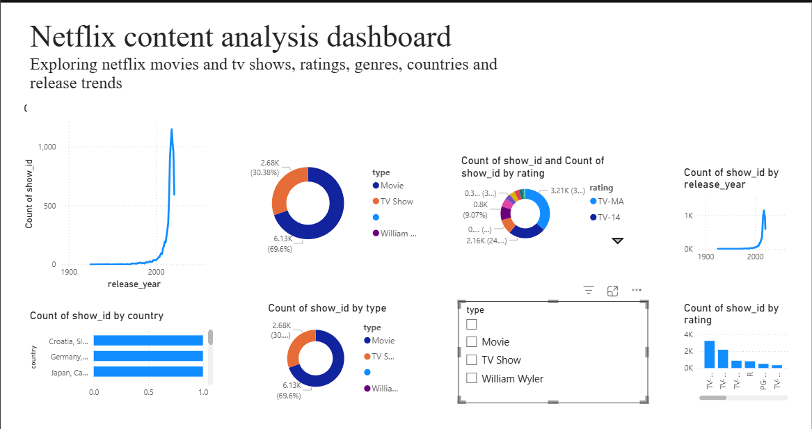

# Netflix Content Analysis Dashboard

## 📊 Project Overview

This project uses **Power BI** to analyze Netflix movies and TV shows and present key information through an interactive dashboard.

The dashboard explores Netflix content based on content type, release year, ratings, genres, and countries.

## 🛠️ Tools Used

* Power BI
* Data Visualization
* Data Analysis
* CSV Dataset

## 📈 Dashboard Insights

The dashboard includes:

* Total Netflix titles
* Movies vs TV Shows
* Content by release year
* Content by rating
* Content by genre
* Top countries by number of titles

## 🎯 Project Objective

The objective of this project is to practice data visualization and exploratory analysis using Power BI and create a simple, interactive dashboard from a real-world dataset.

## 📷 Dashboard Preview

## 📁 Files

* `Netflix_Content_Analysis.pbix` — Power BI dashboard file
* `Netflix_Dashboard.png` — Dashboard screenshot
* `README.md` — Project documentation

## 👩‍💻 Created By

**Ayushi Chauhan**

Aspiring Data Analyst | Computer Science Graduate
